# mySpringAi-demo — Spring AI 全端展示專案

> **Java 25 × Spring Boot 4.1 × Spring AI 2.0** 打造的 LLM 整合對照實驗場 — 23 條端點，把對話記憶、四種 RAG、兩套語意快取、工具呼叫、結構化輸出與多模態生成攤在同一個 UI 上，逐一點開比較。

<p>
  
  
  
  
  
</p>
<p>
  
  
  
  
</p>
<p>
  
  
  
  
  
</p>
<p>
  
  
  
  
  
</p>

後端一個 Spring Boot 應用（8 個 Controller、7 個預先組好的 `ChatClient` Bean），前端一個 React SPA（23 條路由，選單由一份設定檔驅動）。

**這個 repo 的重點不在業務複雜度，而在「同一件事刻意用多種作法並陳」**，方便直接對照差異：

| 對照組 | A | B |
|---|---|---|
| LLM 供應商 | OpenAI `gpt-4.1-mini`（雲端） | Ollama `llama3.2:1b`（本機） |
| 對話記憶 | In-Memory（重啟即失） | JDBC／H2（檔案持久化） |
| RAG 策略 | 手動 `similaritySearch` 自己組 prompt | `RetrievalAugmentationAdvisor` 一行搞定 |
| 檢索來源 | Qdrant 向量庫（離線語料） | Tavily Web Search（即時網路） |
| 語意快取 | Redis（RediSearch，閾值 0.9） | Qdrant（`caching-collection`，閾值 0.8） |
| RAG 管線深度 | 只做檢索＋增強 | 前置查詢翻譯 ＋ 後置 PII 遮罩 |

| 子專案 | Port | 定位 |
|---|---|---|
| [`mySpringAi`](./mySpringAi) | **8080** | Spring Boot 4.1 後端 — 所有 LLM 整合模式的實作，Docker 服務由 `spring-boot-docker-compose` 自動帶起 |
| [`mySpringAi-ui`](./mySpringAi-ui) | **5173** | React 19 + Vite 8 前端 — 深色主題 SPA，把每條後端端點包成一個可互動的展示頁 |

> 本專案以學習與實驗為目的。部分設定（開放的 Actuator 端點、空密碼的 H2 Console、100% trace 採樣率、提交進版控的 `api.properties`）僅適用本機，**不可直接用於正式環境** — 完整清單見 [已知的刻意取捨](#已知的刻意取捨)。
> 遇到問題？ → [疑難排解](#疑難排解)

---

## 目錄

1. [視覺展示](#1-視覺展示)
2. [系統架構與專案結構](#2-系統架構與專案結構)
3. [核心功能與亮點](#3-核心功能與亮點)
4. [技術棧](#4-技術棧)
5. [快速開始與本地部署](#5-快速開始與本地部署)
6. [附錄](#6-附錄)

---

## 1. 視覺展示

### 一則問答的完整旅程

`POST /rag/preAndPostRAAdvisor` 這一條路徑同時用到 Vite 代理改寫、查詢翻譯、向量檢索、PII 遮罩、prompt 增強與兩層觀測 Advisor —— 幾乎是本專案所有機制的縮影。

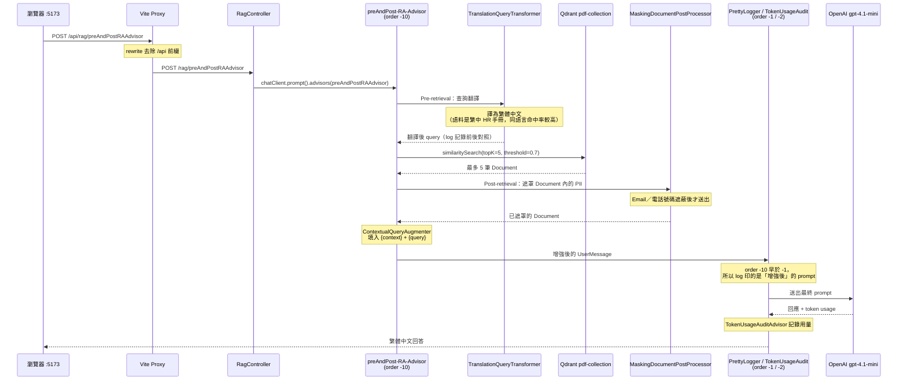

> 📌 **Advisor 的 order 決定你在 log 裡看到什麼。** RA Advisor 設為 `-10`、`PrettyLoggerAdvisor` 為 `-1` —— 數字小的先執行，所以 logger 攔截到的已是檢索增強**之後**的 prompt。若把順序對調，log 只會印出使用者原始問句，完全看不到 RAG 實際塞了什麼進去。

### 語意快取命中與否的兩條路

語意快取比對的是**語意相似度**而非字串相等 —— 「台灣的首都是哪裡」與「請問台灣首都在哪」會命中同一筆快取。命中時整個 LLM 呼叫被短路，不產生任何 token 費用。

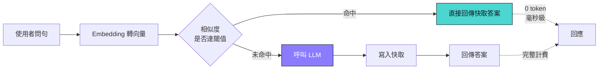

### 畫面截圖

> 展開下方分組可看其餘 12 張；所有截圖放在 [`docs/screenshots/`](./docs/screenshots)。

#### 首頁

**API Playground** — `http://localhost:5173`。左側選單由 `src/config/apiRoutes.js` 的 8 個群組動態產生，每一項都標註了該端點使用的模型（`gpt-4.1-mini`、`llama3.2:1b`、`whisper-1`…）；右側是共用的 `ChatBox`，標頭顯示對應的 API 端口。尚未送出請求時，中央會顯示 `apiTestGuides.js` 提供的**測試重點**與**建議提問** —— 以無記憶對話為例，它直接給了「我叫做 Tony」與「我叫什麼名字？（預期：LLM 不知道）」這組對照用的提示。頂端輸入的使用者名稱會成為需要記憶的端點的 `conversationId`。

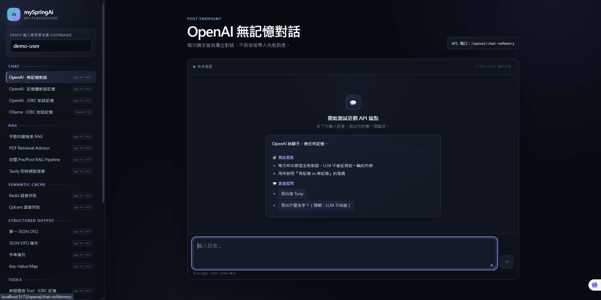

<details>
<summary><b>💬 對話與檢索 — JDBC 記憶、PDF RAG、客服工單 Tool</b></summary>

<br>

**JDBC 對話記憶** — `/openai/chat-jdbc`，使用者 `demo-user` 的連續兩輪對話。第一輪說「記住我最喜歡的顏色是藍色」，第二輪只問「我最喜歡的顏色是什麼」就能正確答出藍色 —— 因為 `MessageChatMemoryAdvisor` 以 `userName` 為 `conversationId`，把歷史從 H2 的 `SPRING_AI_CHAT_MEMORY` 表撈回來塞進 prompt。**重啟後端後歷史仍在**，這正是它與 In-Memory 版本的差別。

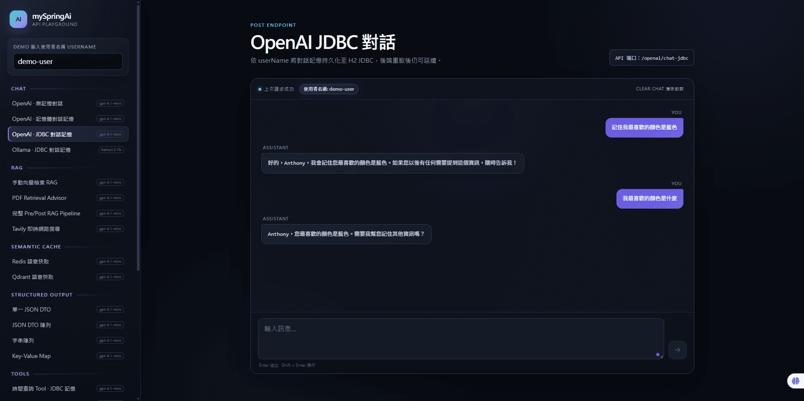

**PDF RAG** — `/rag/ragPdf`，問「遠端工作政策是什麼？」。答案（每週最多 WFH 2 天、須連線公司 VPN、參加每日站會與每週例會）完全來自 `ApexTech_Solutions_HR_Policy_Manual.pdf` —— 這些內容不在模型的訓練資料裡，是 `pdf-RA-Advisor` 對 Qdrant `pdf-collection` 做 topK=3、threshold=0.5 檢索後，填進 `RagPdfPromptTemplate.st` 的 `{context}` 才讓模型答得出來。

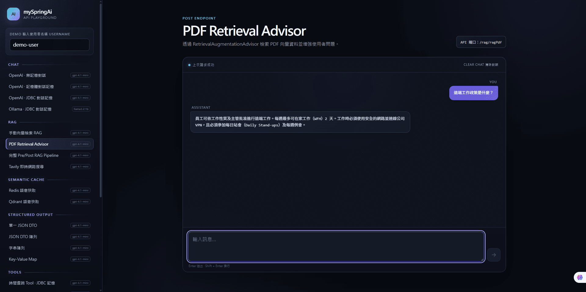

**客服工單 Tool** — `/tool/helpDeskTicket`。使用者說「我的 Nova AI Pro 帳號無法登入，請幫我建立工單」，模型**沒有直接開新單**，而是先呼叫 `getTicketStatus` 查到既有工單，回覆「您已有相似的工單，工單編號為 17，狀態為 OPEN，預計處理時間是 2026-07-24」。查詢用的 `userName` 由後端經 `toolContext` 注入，**不交給 LLM 自行填寫**，因此模型無法偽造他人身分查別人的工單。

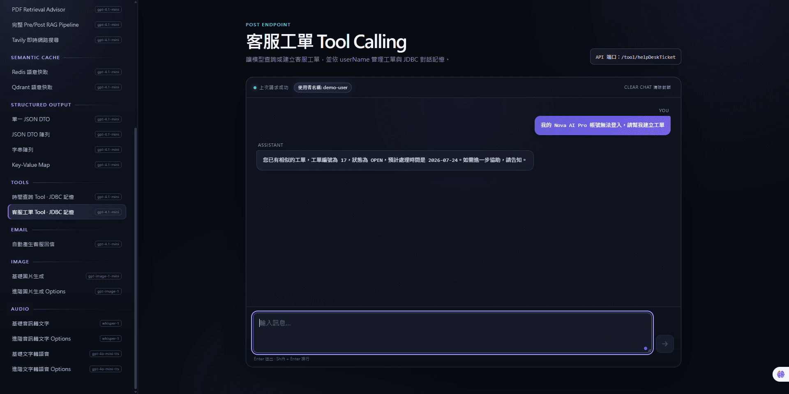

</details>

<details>
<summary><b>⚡ 語意快取 — 一次命中的前後對照</b></summary>

<br>

**前端提問** — `/cache/redisCaching-chat`，問「請介紹 Spring Boot」，秒回一段完整的 Spring Boot 介紹。

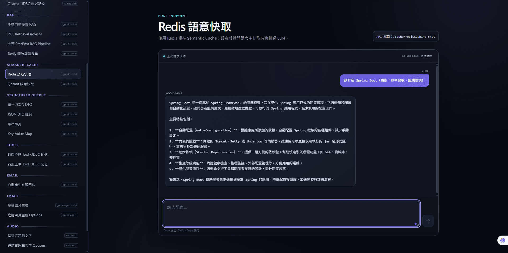

**Redis Insight 裡的那筆快取** — `http://localhost:8001`。同一筆資料在 Redis 中是一個 44 KB 的 JSON key `cache:fedfdca3-…`，欄位包含 `context_hash`、`embedding`、`response`、`response_text` 與 `content`。

關鍵在最後一欄：**`content` 的值是「什麼是 Spring Boot？」，而剛才在 UI 輸入的是「請介紹 Spring Boot」** —— 兩句話的字面完全不同，卻命中了同一筆快取。這就是語意快取與一般 key-value 快取的根本差異：比對的是 embedding 向量的相似度（Redis 後端閾值 0.9），不是字串相等。命中時整個 LLM 呼叫被短路，`TokenUsageAuditAdvisor` 不會記錄到任何新的 token 用量。

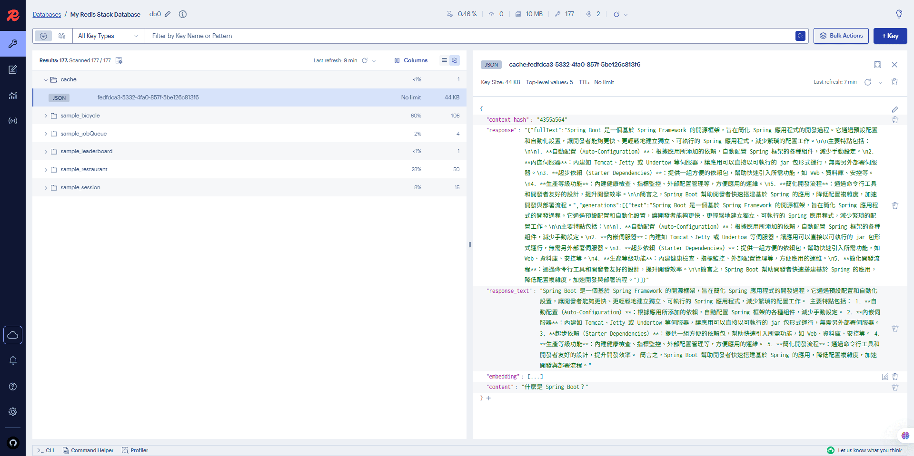

</details>

<details>
<summary><b>🎨 多模態 — 圖片生成與語音合成</b></summary>

<br>

**進階圖片生成** — `/image/image-options`，以「未來城市的空中捷運站，廣角構圖，科幻概念藝術」搭配 model `gpt-image-1`、quality `auto`、size `1024x1024` 產圖。產出的 PNG 落在後端 `image-output/`，再由 `WebMvcConfig` 的資源映射以 `/generated-images/**` 對外提供，前端直接 `` 引用 —— 瀏覽器碰不到後端磁碟，這層映射就是兩者之間的橋。

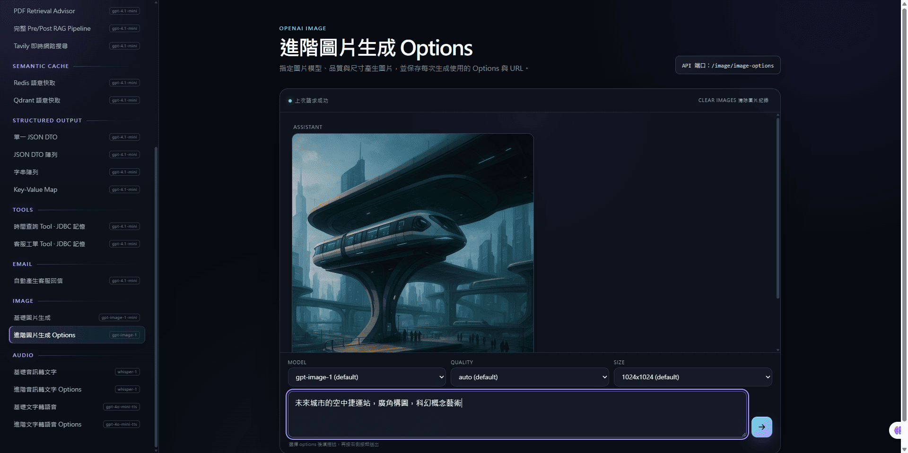

**進階文字轉語音** — `/audio/text-to-speech-options`，voice `alloy`、speed `1`、format `mp3`，把「各位旅客您好，本班列車即將抵達終點站。」合成為 5 秒語音。回應是二進位串流而非檔案路徑，前端收到後轉成 blob URL 直接播放並提供下載 —— **後端不留檔**，離開頁面即釋放。

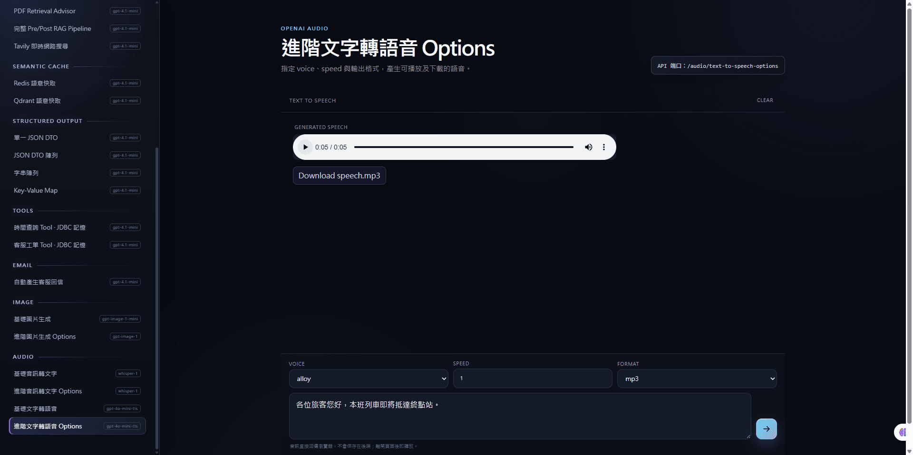

</details>

<details>
<summary><b>🔭 觀測性與資料層 — Jaeger、Grafana、Qdrant</b></summary>

<br>

**Jaeger — trace 清單** — `http://localhost:16686`。不同端點的成本差異一眼可見：`/tool/helpDeskTicket` 花 **2.93s／15 spans**、`/rag/ragPdf` 是 **2.66s／12 spans**，而單純的 `/openai/chat-jdbc` 只有 **1.1–1.3s／9 spans**。多出來的 span 正是工具呼叫的額外 LLM 往返與向量檢索。

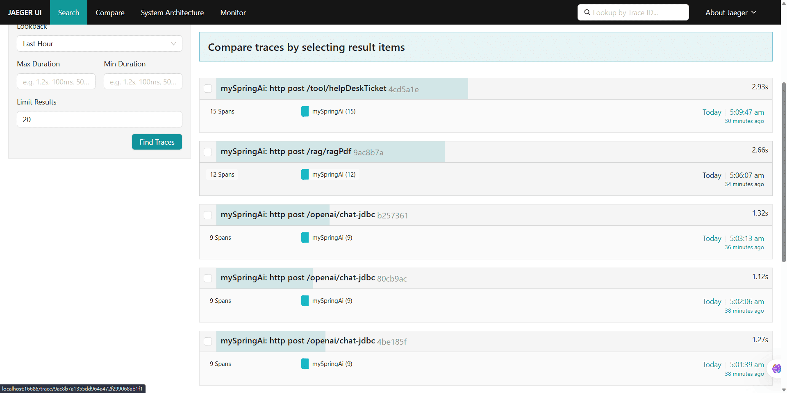

**Jaeger — `/rag/preAndPostRAAdvisor` 的 span 瀑布** — 這張圖把 [§1 開頭的時序圖](#一則問答的完整旅程)變成了實測數據：**總時長 6.47s、depth 9、共 17 個 span**。展開後可以看到三段各自獨立的耗時：

| span | 耗時 | 對應機制 |
|---|---|---|
| `retrieval_augmentation` → `spring_ai chat_client` → `chat gpt-4.1-mini` | 1.67s | **前置查詢翻譯** —— 翻譯本身就是一次完整的 LLM 呼叫 |
| `qdrant query` → `embedding text-embedding-ada-002` | 1.62s（其中 embedding 1.51s） | **向量檢索** —— 這個 span 之所以存在，是因為 `VectorStoreConfig` 手動注入了 `ObservationRegistry` |
| `token_usage_audit` → `pretty_logger` → `chat gpt-4.1-mini` | 3.06s | **最終生成** —— 帶著增強後 prompt 的那次呼叫 |

換句話說，一條「看起來只是問一句話」的 RAG 端點，實際上打了**兩次 LLM 與一次 embedding**，而且翻譯佔掉了四分之一的總時間。這是只看回應內容永遠不會發現的成本結構。

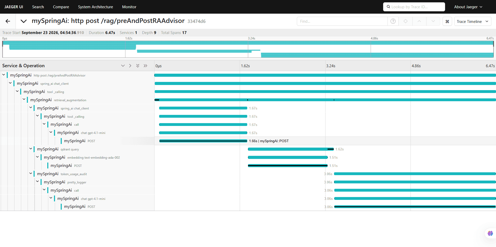

**Grafana — Gen AI Token 消耗** — `http://localhost:3000`（admin/admin）。`mySpringAi` 儀表板的 `Gen AI Total Token Consumption` 面板把三條序列疊在一起：OpenAI `gpt-4.1-mini` 的 chat（tooltip 顯示累計 6,966 tokens）、Ollama `llama3.2:1b` 的 chat、以及 `text-embedding-ada-002` 的 embedding。**本機模型與雲端模型的用量在同一張圖上直接對照**，指標由 Spring AI 自帶的 `gen_ai_*` 系列提供，經 Actuator 由 Prometheus 抓取。

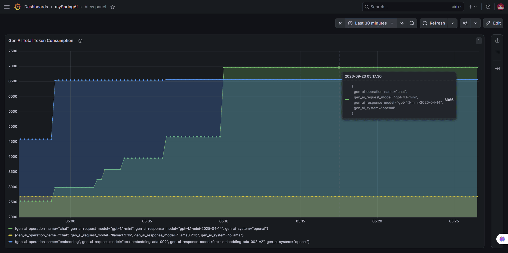

**Grafana Explore — 查 Ollama 的 token 明細** — 同一份指標改用 Explore 直接下 PromQL：`gen_ai_client_token_usage_total{gen_ai_system="ollama"}`，以 stacked lines 拆出 `input`／`output`／`total` 三種 `gen_ai_token_type`。排查「到底是輸入還輸出吃掉 token」時，這裡比儀表板直接。

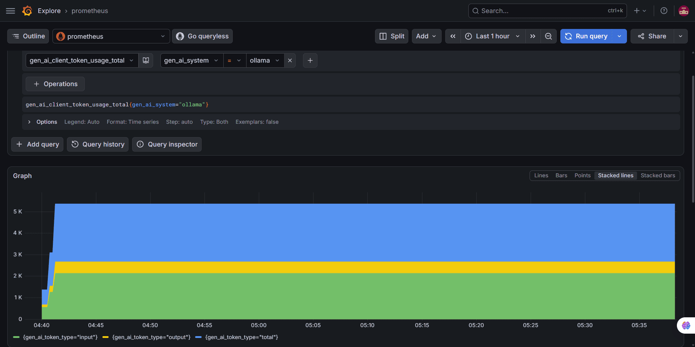

**Qdrant Dashboard** — `http://localhost:6333/dashboard`（Qdrant v1.18.2）。三個 collection 狀態全為 GREEN，向量設定一致（**1536 維、Cosine 距離**，對應 OpenAI embedding 模型）：`rag-collection` 57 個 point（starter 依 properties 自動建立）、`pdf-collection` 8 個（HR 手冊切出的 chunk）、`caching-collection` 1 個（目前只快取了一筆問答）。

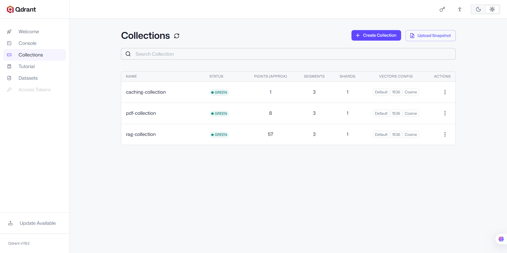

</details>

---

## 2. 系統架構與專案結構

### 全景架構圖

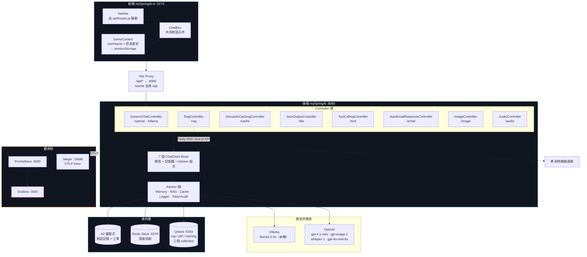

### ChatClient Bean 一覽

`config/ChatClientConfig.java` 是整個後端的架構核心 —— 每個 Bean 就是一組「模型 ＋ 記憶體 ＋ Advisor 堆疊」的固定組合，Controller 只負責挑一個來用。

| Bean | 模型 | 記憶體 | 額外 Advisor／工具 | 使用端點 |
|---|---|---|---|---|
| `openaiCCNoMem` | OpenAI | 無 | — | `/openai/chat-noMemory`、`/rag/*`、`/dto/*`、`/email/*` |
| `openaiCCNoMemRedisCache` | OpenAI | 無 | `redisSemanticCacheAdvisor` | `/cache/redisCaching-chat` |
| `openaiCCNoMemQdrantCache` | OpenAI | 無 | `qdrantSemanticCacheAdvisor` | `/cache/qdrantCaching-chat` |
| `openaiCCInMemory` | OpenAI | In-Memory | `MessageChatMemoryAdvisor` | `/openai/chat-inMemory` |
| `openaiCCJdbcMemory` | OpenAI | JDBC／H2 | `MessageChatMemoryAdvisor` | `/openai/chat-jdbc` |
| `ollamaCCJdbcMemory` | Ollama | JDBC／H2 | `MessageChatMemoryAdvisor` | `/ollama/chat-jdbc` |
| `openaiCCJdbcMemoryWithToolCalling` | OpenAI | JDBC／H2 | `ToolCallingAdvisor` + 預設掛載 `TimeTool` | `/tool/time`、`/tool/helpDeskTicket` |

**七個 Bean 共用的預設值**：`temperature=0.5`、`maxTokens=500`、`.defaultAdvisors(TokenUsageAuditAdvisor, PrettyLoggerAdvisor)`、`.defaultSystem("回答時請使用清楚、易理解且專業的繁體中文。")`。

> ⚠️ 系統提示詞是寫在 `ChatClientConfig` 的 `.defaultSystem(...)`，**不在 `application.properties`**。`/rag/rag` 這類自行組 system prompt 的端點會覆寫掉它。

### Advisor 鏈與執行順序

Controller 透過在 `ChatClient` 呼叫上附加 Advisor 來組合行為，**order 數字小的先執行**：

```
請求（Request）
  │
  ▼
RetrievalAugmentationAdvisor   (order -10) ── 查詢改寫 → 向量檢索 → PII 遮罩 → 增強 prompt
  │
  ▼
TokenUsageAuditAdvisor         (order  -2) ── 回應後記錄 token 用量
  │
  ▼
PrettyLoggerAdvisor            (order  -1) ── 格式化輸出請求／回應，帶 LLM 呼叫序號 #1 #2 #3…
  │
  ▼
MessageChatMemoryAdvisor              ────── 依 conversationId 注入／回寫對話歷史
  │
  ▼
SemanticCacheAdvisor                  ────── 命中即短路，不再往下呼叫 LLM
  │
  ▼
LLM（OpenAI ／ Ollama）
```

`PrettyLoggerAdvisor` 是 `@Component` 單例，七個 ChatClient 共用同一實例 —— 因為它內部持有 LLM 呼叫序號計數器，而 `WebMvcConfig` 註冊的 `HandlerInterceptor` 會在每個 HTTP 請求的 `preHandle` 呼叫 `reset()` 讓序號歸零。這樣一來，log 裡的 `#1`、`#2`、`#3` 就能直接讀成「這一次 API 請求內發生了三次 LLM 呼叫」—— Tool Calling 場景下特別有用。

### 對話隔離

HTTP header `userName` 作為 `MessageChatMemoryAdvisor` 的 `conversationId`。不同端點各自維持獨立的對話歷史：

| 端點 | `conversationId` | 效果 |
|---|---|---|
| `/openai/chat-inMemory`、`/openai/chat-jdbc`、`/ollama/chat-jdbc` | `{userName}` | 同一使用者在這幾條端點共用一份歷史 |
| `/tool/time` | `tool-{userName}` | 時間工具對話獨立 |
| `/tool/helpDeskTicket` | `toolHelpDeskTicket-{userName}` | 工單對話獨立，不被閒聊污染 |

前端則以 `{ [userName]: { [endpoint]: [...messages] } }` 的結構在 `sessionStorage` 保存各端點的訊息，因此切換頁面或重新整理都不會混在一起。

### 專案結構

```
springai-demo/
├── mySpringAi/                                   # Spring Boot 後端
│   ├── src/main/java/com/example/mySpringAi/
│   │   ├── advisor/                              # PrettyLoggerAdvisor（單例，帶呼叫計數器）
│   │   │                                         # TokenUsageAuditAdvisor（token 用量稽核）
│   │   ├── config/                               # ★ 架構核心，9 個設定類別
│   │   │   ├── ChatClientBuilderConfig.java      #   手寫 builder，解 OpenAI/Ollama 雙 ChatModel 歧義
│   │   │   ├── ChatClientConfig.java             #   ★ 7 個 ChatClient Bean
│   │   │   ├── ChatMemoryConfig.java             #   inMemoryChatMemory / jdbcChatMemory
│   │   │   ├── EmbeddingModelConfig.java         #   openaiEmbedding(@Primary) / ollamaEmbedding
│   │   │   ├── RAAdvisorConfig.java              #   ★ 三個 RetrievalAugmentationAdvisor
│   │   │   ├── SemanticCacheAdvisorConfig.java   #   Redis(0.9) / Qdrant(0.8) 兩套快取
│   │   │   ├── ToolExecutionExceptionConfig.java #   工具例外直接拋出，不餵回 LLM
│   │   │   ├── VectorStoreConfig.java            #   pdfVectorStore / cachingVectorStore
│   │   │   └── WebMvcConfig.java                 #   計數器 reset + /generated-images/** 映射
│   │   ├── controller/                           # 8 個 Controller + AudioControllerAdvice
│   │   ├── dto/                                  # CountryCitiesDto、ImageGenerationResponseDto…
│   │   ├── entity/                               # HelpDeskTicketEntity（JPA）
│   │   ├── payload/                              # 請求 record（MessageChatPayload…）
│   │   ├── repo/ · service/                      # 工單資料存取與商業邏輯
│   │   ├── tools/                                # TimeTool、HelpDeskTicketTool（@Tool）
│   │   └── util/
│   │       ├── MaskingDocumentPostProcessor.java # RAG 後處理：Email／電話 PII 遮罩
│   │       └── component/rag/                    # RagDataLoader、TavilyWebSearchDocumentRetriever
│   ├── src/main/resources/
│   │   ├── application.properties                # 模型、H2、Qdrant、Redis、OTel、上傳限制
│   │   ├── application-monitoring.properties     # 只有一行：開啟 trace 匯出
│   │   ├── api.properties                        # ⚠️ Tavily 金鑰，目前在版控中（見附錄）
│   │   ├── promptTemplate/                       # 4 個 StringTemplate（.st）
│   │   ├── ApexTech_Solutions_HR_Policy_Manual.pdf   # RAG 語料（繁體中文）
│   │   └── SpringAI.mp3                          # 轉錄測試素材
│   ├── image-output/                             # 生成圖片落地處，對外映射 /generated-images/**
│   ├── audio-output/                             # 早期版本殘留；TTS 目前直接串流回傳，不寫檔
│   ├── h2db/                                     # H2 檔案式資料庫
│   ├── compose.yml                               # ★ 5 個服務，由 Boot 啟動時自動帶起
│   ├── prometheus-config.yml                     # 掛載進 Prometheus 容器
│   └── pom.xml
│
├── mySpringAi-ui/                                # React 前端
│   ├── src/
│   │   ├── api/client.js                         # Axios 實例（baseURL + 120s timeout）
│   │   ├── components/
│   │   │   ├── ChatBox.jsx                       # ★ 核心可重用元件，含 errorToText()
│   │   │   ├── Navbar.jsx                        # 由 apiGroups 驅動的側邊欄
│   │   │   ├── AudioSpeechDemo.jsx               # TTS + 二進位播放
│   │   │   └── AudioTranscriptionDemo.jsx        # 檔案上傳轉錄
│   │   ├── config/
│   │   │   ├── apiRoutes.js                      # ★ 導覽選單唯一來源（8 群組 / 23 路由）
│   │   │   └── apiTestGuides.js                  # 各端點的範例查詢與測試要點
│   │   ├── context/DemoContext.jsx               # 全域狀態 → sessionStorage
│   │   ├── pages/                                # 25 個薄包裝頁面元件
│   │   ├── App.jsx                               # 23 條 demo 路由 + index 導向 + 404
│   │   └── App.css                               # 深色主題設計系統（CSS 變數）
│   ├── vite.config.js                            # ★ /api → :8080，並 rewrite 去除前綴
│   └── package.json
│
├── docs/screenshots/                             # README 使用的畫面截圖
├── CLAUDE.md · AGENTS.md
└── README.md
```

---

## 3. 核心功能與亮點

本節只談**為什麼這樣設計**與各機制的取捨；實際指令一律在 [§5 快速開始與本地部署](#5-快速開始與本地部署)，端點清單與參數在 [§6 附錄](#6-附錄)。

| 主題 | 一句話 |
|---|---|
| [🧱 一個 Bean 一種組合](#-一個-bean-一種組合) | 手寫 builder 是為了讓兩個 ChatModel 能共存 |
| [🔍 四種 RAG 策略並陳](#-四種-rag-策略並陳) | 從「自己組 prompt」到「完整前後處理管線」的光譜 |
| [⚡ 兩套語意快取對照](#-兩套語意快取對照) | 閾值 0.9 與 0.8 的差別，用問就知道 |
| [🧰 工具呼叫與 toolContext](#-工具呼叫與-toolcontext) | 使用者身分不能交給 LLM 自己填 |
| [📐 結構化輸出四種形態](#-結構化輸出四種形態) | 讓 LLM 回傳的東西可以直接當 Java 物件用 |
| [🎨 多模態與檔案輸出](#-多模態與檔案輸出) | 生成的圖片怎麼從後端磁碟送到瀏覽器 |
| [🔭 觀測性三件套](#-觀測性三件套) | 向量檢索要手動接 ObservationRegistry 才有 span |
| [🖥️ 資料驅動的前端導覽](#️-資料驅動的前端導覽) | 新增一個展示頁只要動三個地方 |

### 🧱 一個 Bean 一種組合

Spring AI 的 auto-config 會替你準備好 `ChatClient.Builder`，但**前提是 context 裡只有一個 `ChatModel`**。本專案同時引入 `spring-ai-starter-model-openai` 與 `spring-ai-starter-model-ollama`，於是出現兩個 `ChatModel` Bean，auto-config 因歧義而無法決定要用哪個，應用直接啟動失敗。

`ChatClientBuilderConfig` 的作法是手寫兩個具名 builder 覆蓋掉 auto-config：

```java
@Primary
@Bean("openaiBuilder")
@Scope(ConfigurableBeanFactory.SCOPE_PROTOTYPE)          // ← 關鍵
public ChatClient.Builder openaiBuilder(OpenAiChatModel model, ObservationRegistry registry) {
    return ChatClient.builder(model, registry, null, null);
}
```

**為什麼一定要 prototype scope？** `ChatClient.Builder` 是可變物件 —— 任何注入點呼叫 `.defaultSystem(...)` 或 `.defaultAdvisors(...)` 都會就地修改它。若是單例，`RAAdvisorConfig` 裡建立翻譯器用的 builder 被改過之後，其他使用者拿到的就是被污染的版本。改成 prototype 後每個注入點各拿一份新的，這也正是 Spring AI 官方 `ChatClientAutoConfiguration` 的作法。

在此之上，`ChatClientConfig` 把七種「模型 ＋ 記憶體 ＋ Advisor」組合固定成七個具名 Bean。Controller 只用 `@Qualifier` 挑一個，因此**同一個 Controller 永遠是同一種行為**，要比較差異就換端點 —— 這正是這個 repo 想呈現的對照方式。

### 🔍 四種 RAG 策略並陳

四條端點都會「找資料，再讓 LLM 根據資料回答」，但差別在於：**資料從哪裡找**、**RAG 流程由誰編排**，以及是否加入額外的前／後處理。`/rag/rag`、`/rag/ragPdf` 與 `/rag/preAndPostRAAdvisor` 都使用本機繁體中文 HR 手冊的向量資料；`/rag/ragTavily` 則改用即時網路搜尋，並非同一份語料。

| 端點 | 文件來源 | RAG 流程誰負責 | 額外處理 |
|---|---|---|---|
| `/rag/rag` | Qdrant `rag-collection` | **Controller 手寫**：查詢、整理文件、組 prompt 都在 Controller | topK=5、threshold=0.8 |
| `/rag/ragPdf` | Qdrant `pdf-collection` | **`RetrievalAugmentationAdvisor`**：自動檢索並將 context 加進 prompt | topK=3、threshold=0.5 |
| `/rag/ragTavily` | Tavily Web Search API | **`RetrievalAugmentationAdvisor`**：流程相同，但改用自訂的 `TavilyWebSearchDocumentRetriever` | 即時網路搜尋；結果與筆數由 Tavily API 決定 |
| `/rag/preAndPostRAAdvisor` | Qdrant `pdf-collection` | **`RetrievalAugmentationAdvisor`**：自動檢索與 prompt 增強 | topK=5、threshold=0.7；前置 query 翻譯、後置 PII 遮罩 |

用流程看會更直接：

```text
/rag/rag
Controller：查 Qdrant → 將文件填入 system prompt → 呼叫 LLM

/rag/ragPdf
Advisor：查 Qdrant → 將文件與問題組成增強後 user prompt → 呼叫 LLM

/rag/ragTavily
Advisor：查 Tavily 網路 → 將搜尋結果與問題組成增強後 user prompt → 呼叫 LLM

/rag/preAndPostRAAdvisor
Advisor：翻譯問題 → 查 Qdrant → 遮罩文件 PII → 組成增強後 user prompt → 呼叫 LLM
```

三個對照重點：

1. **手動 vs Advisor** — `/rag/rag` 把檢索結果填入 **system** prompt 的 `{documents}`；其餘三條則由 `RetrievalAugmentationAdvisor` 改寫 **user** message，template placeholder 必須是 `{context}` 與 `{query}`（Spring AI 的規定），兩種 template 不能直接互換。
2. **Tavily 是替換 Retriever，不是更複雜的同語料版本** — `/rag/ragPdf` 與 `/rag/ragTavily` 的 RAG 編排方式相同；差別只在前者查本機 Qdrant，後者查即時網路。這展示了只替換 Retriever 即可更換知識來源。
3. **進階前／後處理** — `preAndPost-RA-Advisor` 的 `TranslationQueryTransformer` 將 query 翻成 `traditional chinese`，讓查詢與 `pdf-collection` 的繁中語料對齊；檢索後的 `MaskingDocumentPostProcessor` 在文件加入 prompt 前遮掉 Email 與電話，因此 PII 不會送往 LLM。此端點多一次翻譯 LLM 呼叫，會增加延遲與 token 成本。

三個 RA Advisor 都設定 `.order(-10)`，早於 `PrettyLoggerAdvisor` 的 `-1`；因此 logger 會看到已完成 RAG 增強的 prompt，而非原始問題。

### ⚡ 兩套語意快取對照

`SemanticCacheAdvisor` 命中時直接回傳快取內容，**整個 LLM 呼叫被短路**，既不計 token 也沒有網路往返。兩套後端的差別只在相似度閾值與儲存引擎：

| | Redis 快取 | Qdrant 快取 |
|---|---|---|
| 端點 | `/cache/redisCaching-chat` | `/cache/qdrantCaching-chat` |
| 儲存 | Redis Stack（RediSearch 向量索引） | Qdrant `caching-collection` |
| 閾值 | **0.9**（嚴格） | **0.8**（寬鬆） |
| 表現 | 幾乎同義才命中，誤答風險低 | 命中率高，但相近主題可能拿到不對的答案 |
| 觀察方式 | Redis Insight `:8001` | Qdrant Dashboard `:6333` |

實測方法很簡單：對同一條端點連問兩次幾乎相同的問題，第二次的回應時間會從數秒掉到毫秒級，且 `TokenUsageAuditAdvisor` 不會記錄到新的 token 用量。把同一組問題分別丟給兩條端點，就能直接感受 0.9 與 0.8 在「寧可漏接」與「寧可誤中」之間的取捨。

### 🧰 工具呼叫與 toolContext

`/tool/helpDeskTicket` 這條端點的重點不在於「LLM 會呼叫工具」，而在於**哪些參數不該由 LLM 決定**：

```java
String response = chatClient.prompt()
        .system(helpDeskTicketPromptTemplate)         // 載入客服流程規則
        .tools(helpDeskTicketTool)                    // 本次請求專用工具，保留預設的 TimeTool
        .toolContext(Map.of("userName", userName))    // ★ 身分由後端注入，不經過 LLM
        .advisors(a -> a.param(CONVERSATION_ID, "toolHelpDeskTicket-" + userName))
        .user(payload.message())
        .call().content();
```

`userName` 走 `toolContext` 而非工具參數，代表**模型無法偽造他人身分**去查詢工單 —— 即使使用者在提示詞裡宣稱自己是別人，`getTicketStatus` 拿到的仍是 header 帶進來的真實身分。這是 Tool Calling 最容易被忽略的安全邊界。

另外兩個細節：

- **`returnDirect = true`** — `createTicket` 與 `getCurrentLocalTime` 標記了 `returnDirect`，工具結果直接成為回應，不再送回 LLM 潤飾。省一次呼叫，但回傳的是 JSON 字串，所以 Controller 用 `unwrapJsonString()` 把它反序列化回純文字，讓 `\n` 這類跳脫字元正常顯示。
- **工具例外不餵回 LLM** — `ToolExecutionExceptionConfig` 把 `ToolExecutionExceptionProcessor` 設為直接拋出。預設行為是把錯誤訊息交還給模型讓它「想辦法處理」，那會讓失敗被一段模型幻想的說法蓋過去；直接拋出則讓錯誤在 HTTP 層現形。

### 📐 結構化輸出四種形態

`/dto/*` 四條端點展示 Spring AI 的 `.entity()` 如何把模型回應直接轉成 Java 型別，省去手動剖析 JSON：

| 端點 | 回傳型別 | 適用情境 |
|---|---|---|
| `/dto/generateJsonDto` | `CountryCitiesDto{ country, city }` | 單一固定結構的物件 |
| `/dto/generateListJsonDto` | `List<CountryCitiesDto>` | 同結構的多筆資料 |
| `/dto/generateList` | `List<String>` | 純列舉，不需要欄位名 |
| `/dto/generateMap` | `Map<String, Object>` | 結構事前未知、欄位動態 |

Spring AI 會依據目標型別自動產生對應的格式指示附加到 prompt 尾端，並在回應後反序列化。前三者結構明確、容易驗證；`Map<String, Object>` 最有彈性，但也最容易拿到與預期不同的形狀 —— 這組對照就是要讓「型別越明確、輸出越可靠」這件事變得可以直接觀察。

### 🎨 多模態與檔案輸出

圖片與音訊的難處不在呼叫模型，而在**產出的二進位檔案怎麼交到瀏覽器手上**。兩者走了不同路線：

**圖片 —— 落地後以靜態資源提供。** 生成的 PNG 寫入後端的 `image-output/`，`WebMvcConfig` 再把 `/generated-images/**` 映射到那個目錄：

```java
registry.addResourceHandler("/generated-images/**")
        .addResourceLocations(IMAGE_OUTPUT_DIRECTORY.toUri().toString());
```

API 回傳的是 `ImageGenerationResponseDto{ imageUrl }`，前端拿到相對路徑後直接 `` 引用。瀏覽器無法存取後端磁碟，這層映射就是兩者之間的橋。

**音訊 —— 直接串流回應。** TTS 端點回傳 `ResponseEntity<byte[]>`，並依請求的格式設定對應的 Content-Type：

| 格式 | Content-Type |
|---|---|
| `mp3` | `audio/mpeg` |
| `opus` | `audio/ogg` |
| `aac` | `audio/aac` |
| `flac` | `audio/flac` |
| `wav` | `audio/wav` |
| `pcm` | `application/octet-stream` |

與圖片不同，**TTS 不在後端留檔** —— `AudioController` 直接把位元組回傳，前端轉成 blob URL 播放，離開頁面即釋放。轉錄方向則是 `multipart/form-data` 上傳，上限由 `spring.servlet.multipart.max-file-size=25MB` 控制 —— 這個值需要與 Whisper 的檔案大小限制一起考慮。`AudioControllerAdvice` 專門攔截音訊相關例外（例如空檔案）轉成 `AudioErrorResponseDto`，避免前端拿到一坨 stack trace。

### 🔭 觀測性三件套

三種訊號各走各的管道，在 `application.properties` 裡分工明確：

| 訊號 | 路徑 | 關鍵設定 |
|---|---|---|
| Trace | 應用 → OTLP `:4318` → Jaeger `:16686` | `management.opentelemetry.tracing.export.otlp.endpoint` |
| Metrics | Prometheus 抓 `/actuator/prometheus` → Grafana | `management.endpoints.web.exposure.include=health, metrics, prometheus` |
| Token 用量 | `TokenUsageAuditAdvisor` 寫入應用 log | 掛在全部七個 ChatClient 上 |

**向量檢索的 span 要手動接線才會出現。** `VectorStoreConfig` 建立 `pdfVectorStore` 與 `cachingVectorStore` 時明確注入了 `ObservationRegistry`：

```java
QdrantVectorStore.builder(qdrantClient, embeddingModel)
        .collectionName("pdf-collection")
        .observationRegistry(observationRegistry)   // ← 少了這行就沒有檢索 span
        .build();
```

沒有這行，`add`／`delete`／`similaritySearch` 不會產生 `db.vector.client.operation` 指標與追蹤資料 —— Jaeger 上會看到 HTTP span 直接跳到 LLM span，中間那段「到底花多久在檢索」完全消失。同理，七個 ChatClient 也都是用 `ChatClient.builder(model, observationRegistry, null, null)` 明確帶入 registry 而非走無參數版本。

Metrics 部分刻意關掉了 OTLP 匯出（`management.otlp.metrics.export.enabled=false`），只走 Prometheus 一條路 —— 兩邊都開會讓同一份指標重複計算。Trace 採樣率設為 `1.0`（100%），方便本機逐筆檢視，正式環境絕不該這樣設。

### 🖥️ 資料驅動的前端導覽

前端的核心設計是**選單不硬編碼在 JSX 裡**。`src/config/apiRoutes.js` 匯出的 `apiGroups` 是 8 個群組、23 條路由的唯一來源，`Navbar` 直接 map 它產生選單。新增一個展示頁只要動三個地方：

```jsx
// 1. src/config/apiRoutes.js — 在對應群組加一筆（選單自動出現）
{ path: "/my-feature/endpoint", label: "我的功能", model: "gpt-4.1-mini", requiresUserName: true }

// 2. src/App.jsx — 加一條 Route
<Route path="/my-feature/endpoint" element={<MyFeaturePage />} />

// 3. src/pages/MyFeaturePage.jsx — 薄包裝，通常 4–10 行
export default function MyFeaturePage() {
  return <ChatBox endpoint="/my-feature/endpoint" title="我的功能" description="此展示說明。" />;
}
```

> ⚠️ `apiRoutes.js` **只定義選單**，不建立 React Route —— 兩邊都要加。只加前者會出現點了沒反應的選單項，只加後者則是路由存在但選單找不到入口。

`ChatBox` 負責所有共通行為：

- **請求取消** — 用 `AbortController`，元件卸載時清理。換頁時進行中的請求被靜默丟棄，不會跳出誤導性的錯誤訊息。
- **錯誤轉譯** — `errorToText()` 區分四種情境：`axios.isCancel` 回 `null`（不顯示）、有 `error.response` 顯示 `HTTP {status}` 與回應內容、有 `error.request` 顯示「無法連線到後端服務，請確認 Spring Boot 是否已啟動。」、其餘走 `error.message`。
- **前置驗證** — `requiresUserName` 為 true 時，未填使用者名稱會先擋下並提示，不會發出注定 400 的請求。

> 📌 錯誤轉譯的邏輯在 `ChatBox.jsx` 的 `errorToText()`，**不在** `api/client.js` —— 後者目前只設定 `baseURL` 與 120 秒逾時，且刻意不固定 `Content-Type`，讓一般物件走 `application/json`、`FormData` 走帶 boundary 的 `multipart/form-data`。

---

## 4. 技術棧

### 核心框架

| 項目 | 版本 | 說明 |
|---|---|---|
| Java | 25 | `pom.xml` 的 `java.version` |
| Spring Boot | 4.1.0 | `spring-boot-starter-parent` |
| Spring AI | 2.0.0 | 由 `spring-ai-bom` 統一管理版本 |
| Maven | 3.9.11 | 由 Maven Wrapper（`wrapperVersion=3.3.4`）自動下載，使用 `./mvnw`，不需另裝 Maven |
| Lombok | 1.18.46 | Java 23+ 需顯式宣告 `annotationProcessorPaths` |

### Spring AI 模組

| Artifact | 用途 |
|---|---|
| `spring-ai-starter-model-openai` | OpenAI 對話、圖片、語音、embedding |
| `spring-ai-starter-model-ollama` | 本機 Ollama 模型 |
| `spring-ai-starter-model-chat-memory-repository-jdbc` | 自動配置 `JdbcChatMemoryRepository` 與資料表 |
| `spring-ai-starter-vector-store-qdrant` | `QdrantClient` 與預設 `QdrantVectorStore`（建立 `rag-collection`） |
| `spring-ai-rag` | `RetrievalAugmentationAdvisor`、`DocumentRetriever`、`QueryTransformer`、`DocumentPostProcessor` |
| `spring-ai-vector-store-advisor` | `QuestionAnswerAdvisor` / `VectorStoreChatMemoryAdvisor` |
| `spring-ai-redis-semantic-cache` | Redis 語意快取 |
| `spring-ai-tika-document-reader` | Apache Tika 文件解析（PDF／Word／HTML／TXT） |
| `spring-ai-starter-mcp-client` | MCP client 與 tool calling 接線 |

### 資料與中介軟體

| 元件 | 映像檔 | Port（主機） | 用途 |
|---|---|---|---|
| Qdrant | `qdrant/qdrant:latest` | 6333（REST／Dashboard）、**6334（gRPC，應用連這個）** | RAG 向量庫 ＋ 語意快取 |
| Redis Stack | `redis/redis-stack:latest` | 6379（應用）、8001（Insight UI） | 語意快取（RediSearch 向量索引） |
| H2 | 檔案式，非容器 | — | 對話記憶 ＋ 工單資料，位於 `mySpringAi/h2db/` |

> ⚠️ Qdrant 有兩個 port，很容易搞混：`6333` 是 REST 與瀏覽器 Dashboard，`6334` 才是 Spring AI 實際連線的 gRPC —— `application.properties` 裡設的是 **6334**。

其他後端依賴：

| Artifact | 說明 |
|---|---|
| `spring-boot-starter-webmvc` | Web MVC（Boot 4 的新命名，不再是 `spring-boot-starter-web`） |
| `spring-boot-starter-data-jpa` + `h2` | 工單 Entity 與對話記憶儲存 |
| `spring-boot-h2console` | ⚠️ **Boot 4 起 H2 Console 的 autoconfig 被抽成獨立模組** —— 沒有這個依賴，`/h2-console` 不會註冊 |
| `spring-boot-docker-compose` | 應用啟動時自動偵測並帶起 `compose.yml` 的服務 |
| `spring-boot-starter-validation` | Bean Validation |
| `spring-boot-devtools` | 開發期熱重載 |

### 觀測性

| 元件 | 映像檔 | Port | 角色 |
|---|---|---|---|
| Jaeger | `jaegertracing/all-in-one:latest` | 16686（UI）、4317（gRPC）、4318（HTTP） | 接收 OTLP span，提供 trace 瀑布圖 |
| Prometheus | `prom/prometheus` | 9090 | 抓取 `/actuator/prometheus` |
| Grafana | `grafana/grafana` | 3000 | 儀表板（admin/admin），資料持久化於 named volume |
| `spring-boot-starter-opentelemetry` | — | — | Trace 收集與 OTLP 匯出 |
| `micrometer-registry-prometheus` | — | — | Prometheus 格式指標 |
| `spring-boot-starter-actuator` | — | — | 曝露 `health`、`metrics`、`prometheus` |

### 前端

| 技術 | 版本 | 本專案的實際用法 |
|---|---|---|
| **React** | 19.2.7 | 全函數元件 + Hooks；25 個頁面元件中多數僅 4–10 行 |
| **Vite** | 8.1.1 | 開發伺服器 `:5173`；`server.proxy` 將 `/api` 轉發至 `:8080` 並 rewrite 去除前綴 |
| **React Router** | 7.18.1 | `BrowserRouter`，23 條 demo 路由 + index 導向 + 404 |
| **Axios** | 1.18.1 | 單一實例，120 秒逾時；刻意不固定 `Content-Type` 以同時支援 JSON 與 FormData |
| **ESLint** | 10.6.0 | 含 `eslint-plugin-react-hooks` 與 `react-refresh` |
| 狀態管理 | — | React Context（`DemoContext`），**未使用 Redux** |
| 樣式 | — | 原生 CSS 自訂屬性，深色主題（`#10151f` 深海軍藍 ／ `#8b7cff` 紫 ／ `#4bd6d0` 青） |

> ⚠️ 前端**沒有測試框架**（無 vitest／jest），`npm test` 不存在。功能驗證需啟動開發伺服器在瀏覽器中操作。

---

## 5. 快速開始與本地部署

本節只放可執行的指令；設計理由見 [§3 核心功能與亮點](#3-核心功能與亮點)。

### 環境需求

- **JDK 25**（`pom.xml` 宣告 `java.version=25`）
- **Node.js 20+** 與 npm
- **Docker Desktop** — Qdrant、Redis、Prometheus、Grafana、Jaeger 五個容器
- **Maven Wrapper** — 已內建，使用 `./mvnw`（Windows 用 `.\mvnw.cmd`）
- **OpenAI API 金鑰** — 幾乎所有端點都需要
- **Tavily API 金鑰** — 僅 `/rag/ragTavily` 需要
- **Ollama**（選用）— 只有 `/ollama/chat-jdbc` 會用到，需先 `ollama pull llama3.2:1b`

### 四步驟啟動

```powershell
# 1. 設定 OpenAI 金鑰（後端讀 ${OPENAI_API_KEY:}，未設定則為空字串）
$env:OPENAI_API_KEY = "sk-..."

# 2. 啟動後端 —— spring-boot-docker-compose 會自動帶起 compose.yml 的五個容器
cd mySpringAi
.\mvnw.cmd spring-boot:run                  # 監聽 :8080

# 3. 安裝並啟動前端（另開一個終端機）
cd mySpringAi-ui
npm install
npm run dev                                 # 監聽 :5173

# 4. 開啟瀏覽器
# http://localhost:5173 —— 先在頂端輸入使用者名稱，再從左側選單挑一個展示
```

> 📌 **不需要手動 `docker compose up`。** `spring-boot-docker-compose` 依賴會在應用啟動時自動偵測 `mySpringAi/compose.yml` 並帶起容器，關閉應用時依 `spring.docker.compose.stop.command=down` 執行 `down`（移除容器與網路，而非只是 stop）。

若想獨立管理容器生命週期：

```powershell
cd mySpringAi
docker compose up -d        # 一次啟動全部五個服務（此檔未定義任何 profile）
docker compose down         # 停止並移除
docker compose ps           # 確認狀態
```

### 驗證入口

| 用途 | 網址 |
|---|---|
| 後端 API | http://localhost:8080 |
| 前端開發伺服器 | http://localhost:5173 |
| H2 Console | http://localhost:8080/h2-console |
| Actuator ／ Prometheus 指標 | http://localhost:8080/actuator/prometheus |
| Qdrant Dashboard | http://localhost:6333/dashboard |
| Redis Insight | http://localhost:8001 |
| Prometheus | http://localhost:9090 |
| Grafana | http://localhost:3000 |
| Jaeger UI | http://localhost:16686 |

H2 Console 的連線參數：JDBC URL `jdbc:h2:file:./h2db/chatmemory;AUTO_SERVER=true`、使用者 `sa`、**密碼留空**。登入後可查 `SPRING_AI_CHAT_MEMORY`（對話歷史）與工單資料表。

端點清單與請求格式見 [附錄：API 端點總表](#api-端點總表)。

### 環境變數

| 變數 | 預設 | 說明 |
|---|---|---|
| `OPENAI_API_KEY` | 空字串 | 後端 `application.properties` 以 `${OPENAI_API_KEY:}` 讀取 |
| `LOG_FILE_NAME` | `./logs/app.log` | 後端 log 輸出位置 |
| `VITE_API_BASE_URL` | `/api` | 前端 API 基底；預設走 Vite 代理，正式部署時可指向實際後端位址 |

Tavily 金鑰目前放在 `mySpringAi/src/main/resources/api.properties` 的 `tavily.apiKey`，由 `spring.config.import=optional:classpath:api.properties` 匯入。**該檔案目前在版本控制中** —— 相關風險見 [已知的刻意取捨](#已知的刻意取捨)。

### 其他常用指令

```powershell
# 後端
.\mvnw.cmd test                                                                   # 執行測試
.\mvnw.cmd -Dtest=AudioControllerTest test                                        # 單一測試類別
.\mvnw.cmd clean package                                                          # 建置 JAR
.\mvnw.cmd spring-boot:run "-Dspring-boot.run.arguments=--spring.profiles.active=monitoring"

# 前端
npm run build      # 正式建置
npm run preview    # 預覽建置結果
npm run lint       # ESLint
```

### 關於 monitoring profile

`monitoring` 是 **Spring profile，不是 Docker Compose profile**。啟用後套用 `application-monitoring.properties`，內容只有一行：

```properties
management.tracing.export.enabled=true
```

> ⚠️ `compose.yml` **沒有定義任何 profile**，五個容器（Qdrant、Redis、Prometheus、Grafana、Jaeger）一律同時啟動 —— `docker compose --profile monitoring up` 這種寫法對本專案沒有意義。

---

## 6. 附錄

### API 端點總表

所有端點皆為 `POST`。除音訊轉錄走 `multipart/form-data` 外，一律 `Content-Type: application/json`。需要對話記憶的端點必須帶 `userName` HTTP header。

> 📌 前端呼叫時路徑前會多一層 `/api`（例如 `/api/rag/ragPdf`），由 Vite 代理 rewrite 去除後才送到後端。直接用 curl／Postman 打後端時**不要**加 `/api`。

#### 對話 — `/openai`、`/ollama`

| 端點 | 模型 | 記憶體 | `userName` |
|---|---|---|---|
| `POST /openai/chat-noMemory` | gpt-4.1-mini | 無 | ❌ |
| `POST /openai/chat-inMemory` | gpt-4.1-mini | In-Memory | ✅ |
| `POST /openai/chat-jdbc` | gpt-4.1-mini | JDBC／H2 | ✅ |
| `POST /ollama/chat-jdbc` | llama3.2:1b | JDBC／H2 | ✅ |

#### RAG — `/rag`

| 端點 | 策略 | 參數 |
|---|---|---|
| `POST /rag/rag` | 手動對 `rag-collection` 相似度搜尋，結果填入 `RagPromptTemplate.st` 的 `{documents}` 作 system prompt | topK=5、threshold=0.8 |
| `POST /rag/ragPdf` | `pdf-RA-Advisor` 檢索 `pdf-collection`，套 `RagPdfPromptTemplate.st`（`{context}` + `{query}`） | topK=3、threshold=0.5 |
| `POST /rag/ragTavily` | `tavily-RA-Advisor`，經 Tavily API 即時網路搜尋 | 依 API 回傳 |
| `POST /rag/preAndPostRAAdvisor` | 前置：查詢翻譯為繁體中文；後置：Email／電話 PII 遮罩 | topK=5、threshold=0.7 |

#### 語意快取 — `/cache`

| 端點 | 後端 | 相似度閾值 |
|---|---|---|
| `POST /cache/redisCaching-chat` | Redis Stack | 0.9 |
| `POST /cache/qdrantCaching-chat` | Qdrant `caching-collection` | 0.8 |

#### 結構化輸出 — `/dto`

| 端點 | 回傳型別 |
|---|---|
| `POST /dto/generateJsonDto` | `CountryCitiesDto { country: String, city: List<String> }` |
| `POST /dto/generateListJsonDto` | `List<CountryCitiesDto>` |
| `POST /dto/generateList` | `List<String>` |
| `POST /dto/generateMap` | `Map<String, Object>` |

#### 工具呼叫 — `/tool`

| 端點 | 可用工具 | `userName` |
|---|---|---|
| `POST /tool/time` | `getCurrentLocalTime()`（`returnDirect`）、`getCurrentTime(timeZone)` | ✅ |
| `POST /tool/helpDeskTicket` | `createTicket(issue)`（`returnDirect`）、`getTicketStatus()` | ✅ |

`getTicketStatus` 依 `toolContext` 中的 `userName` 篩選，回傳工單編號、問題描述、狀態、建立時間與預計完成時間。

#### Email 自動回覆 — `/email`

| 端點 | 說明 |
|---|---|
| `POST /email/emailResponse` | 依客戶來信自動生成專業回覆，套用 `AutoEmailResponsePromptTemplate.st` |

#### 圖片生成 — `/image`

| 端點 | 模型 | 備註 |
|---|---|---|
| `POST /image/image` | gpt-image-1 | 預設 1024×1024、quality=auto |
| `POST /image/image-options` | 可指定 | 接受 model／quality／size；`n` 固定為 1 |

產出檔名為 `image-{UUID}.png` 與 `image-options-{UUID}.png`，存於 `image-output/`，對外路徑 `/generated-images/**`。

#### 音訊 — `/audio`

| 端點 | 類型 | 備註 |
|---|---|---|
| `POST /audio/transcribe` | 語音轉文字 | `multipart/form-data`，預設設定（whisper-1） |
| `POST /audio/transcribe-options` | 語音轉文字 | `multipart/form-data`，可設定格式、語言、溫度、提示詞 |
| `POST /audio/text-to-speech` | 文字轉語音 | 預設聲音，MP3 輸出 |
| `POST /audio/text-to-speech-options` | 文字轉語音 | 可設定 voice、speed、format |

TTS 回應為二進位串流，**後端不寫檔**（`audio-output/` 內的檔案是早期版本的殘留）。

### 請求與回應格式

| Payload | 欄位 | 使用端點 |
|---|---|---|
| `MessageChatPayload` | `{ "message": "..." }` | 對話、RAG、快取、DTO、Tool、TTS |
| `AutoEmailResponsePayload` | `{ "customerName": "...", "customerMessage": "..." }` | `/email/emailResponse` |
| `ImageOptionsPayload` | `{ "message": "...", "model": "gpt-image-1", "quality": "high", "size": "1024x1024" }` | `/image/image-options` |
| `AudioSpeechOptionsPayload` | `{ "message": "...", "voice": "...", "speed": 1.0, "responseFormat": "mp3" }` | `/audio/text-to-speech-options` |
| `AudioTranscriptionOptionsPayload` | `{ "prompt": "...", "language": "zh", "temperature": 0.0, "responseFormat": "..." }` | `/audio/transcribe-options`（以 `options` part 傳送） |
| `HelpDeskTicketPayload` | `{ "issue": "..." }` | 由 LLM 在工具呼叫時填入 |

| 回應 DTO | 欄位 |
|---|---|
| `ImageGenerationResponseDto` | `{ "imageUrl": "/generated-images/image-{uuid}.png" }` |
| `CountryCitiesDto` | `{ "country": "...", "city": ["...", "..."] }` |
| `AudioTranscriptionResponseDto` | 轉錄文字 |
| `AudioErrorResponseDto` | 音訊端點的錯誤回應（由 `AudioControllerAdvice` 產生） |

音訊轉錄以 `multipart/form-data` 送出：檔案放 `file` part，進階選項以 `options` part 帶 JSON。

### Qdrant 集合一覽

| 集合 | 建立方式 | 使用端點 | 參數 |
|---|---|---|---|
| `rag-collection` | Qdrant starter 依 `application.properties` 自動建立 | `/rag/rag` | topK=5、threshold=0.8 |
| `pdf-collection` | `VectorStoreConfig` 手動建立（`pdfVectorStore`） | `/rag/ragPdf`、`/rag/preAndPostRAAdvisor` | 3／0.5 與 5／0.7 |
| `caching-collection` | `VectorStoreConfig` 手動建立（`cachingVectorStore`） | `/cache/qdrantCaching-chat` | threshold 0.8 |

三者皆設 `initializeSchema(true)`，collection 不存在時會自動建立。Embedding 模型由 `EmbeddingModelConfig` 指定 OpenAI 為 `@Primary`。

### 主要設定項

`mySpringAi/src/main/resources/application.properties` 的關鍵項目：

| Property | 值 | 說明 |
|---|---|---|
| `spring.config.import` | `optional:classpath:api.properties` | 匯入 Tavily 金鑰；`optional:` 代表檔案不存在也能啟動 |
| `spring.ai.openai.api-key` | `${OPENAI_API_KEY:}` | 讀環境變數，預設空字串 |
| `spring.ai.openai.chat.model` | `gpt-4.1-mini` | ⚠️ 是 `chat.model`，**不是** `chat.options.model` |
| `spring.ai.ollama.chat.model` | `llama3.2:1b` | base-url 未覆寫，走預設 `http://localhost:11434` |
| `spring.datasource.url` | `jdbc:h2:file:./h2db/chatmemory;AUTO_SERVER=true` | `AUTO_SERVER` 允許應用執行中同時用 H2 Console 連線 |
| `spring.ai.chat.memory.repository.jdbc.initialize-schema` | `always` | 自動建立 `SPRING_AI_CHAT_MEMORY` 表 |
| `spring.jpa.hibernate.ddl-auto` | `update` | 工單表結構自動同步 |
| `spring.ai.vectorstore.qdrant.port` | `6334` | gRPC（6333 是 REST／Dashboard） |
| `spring.ai.vectorstore.qdrant.collection-name` | `rag-collection` | starter 自動建立的那一個 |
| `spring.data.redis.host` / `.port` | `localhost` / `6379` | 語意快取與 `SemanticCacheAdvisorConfig` 的 Jedis client 共用 |
| `spring.docker.compose.stop.command` | `down` | 應用關閉時移除容器與網路，而非僅 stop |
| `management.endpoints.web.exposure.include` | `health, metrics, prometheus` | Actuator 曝露範圍 |
| `management.opentelemetry.tracing.export.otlp.endpoint` | `http://localhost:4318/v1/traces` | ⚠️ Boot 4 的 key 路徑，**不是** `management.otlp.tracing.endpoint` |
| `management.tracing.sampling.probability` | `1.0` | 100% 採樣，僅適合本機 |
| `management.otlp.metrics.export.enabled` | `false` | 指標只走 Prometheus，避免重複計算 |
| `spring.servlet.multipart.max-file-size` | `25MB` | 音訊上傳上限（`max-request-size` 同值） |
| `logging.level.…PrettyLoggerAdvisor` | `DEBUG` | 不設成 DEBUG 就看不到格式化的 prompt／回應 log |

系統提示詞（`回答時請使用清楚、易理解且專業的繁體中文。`）設在 `ChatClientConfig` 的 `.defaultSystem(...)`，**不在 properties 中**。

### 疑難排解

| 症狀 | 原因與處理 |
|---|---|
| 啟動時報 `ChatModel` Bean 歧義而失敗 | 專案同時有 OpenAI 與 Ollama 兩個 ChatModel。`ChatClientBuilderConfig` 已手寫具名 builder 解決；若自行新增注入 `ChatClient.Builder` 的程式碼，記得加 `@Qualifier("openaiBuilder")` 或 `"ollamaBuilder"` |
| 呼叫端點回 401／金鑰錯誤 | `OPENAI_API_KEY` 未設定。`application.properties` 的預設值是空字串，應用**仍會正常啟動**，要到實際呼叫時才失敗 |
| `/rag/ragTavily` 失敗但其他 RAG 正常 | `api.properties` 缺少 `tavily.apiKey`；該檔以 `optional:` 匯入，缺檔不影響啟動 |
| `/h2-console` 回 404 | 缺少 `spring-boot-h2console` 依賴 —— Boot 4 起這個 autoconfig 被抽成獨立模組 |
| H2 Console 連不上（資料庫被鎖） | JDBC URL 必須含 `;AUTO_SERVER=true`，否則應用執行中無法第二個連線 |
| 連不上 Qdrant | 應用走 **gRPC 6334**，不是 Dashboard 的 6333。確認 `spring.ai.vectorstore.qdrant.port=6334` |
| RAG 檢索不到東西 | 語料尚未載入 `rag-collection` / `pdf-collection`。確認 `RagDataLoader` 已執行，並在 Qdrant Dashboard 檢查 point 數量 |
| RAG 回答與文件無關 | 閾值太低或查詢與語料語言不同。`pdf-collection` 是繁體中文文件，用英文提問建議走 `/rag/preAndPostRAAdvisor`（會先翻譯） |
| log 看不到 RAG 增強後的 prompt | `PrettyLoggerAdvisor` 的 log level 需為 `DEBUG`，且 RA Advisor 的 order 必須小於 `-1` |
| 語意快取似乎沒作用 | 兩次提問的語意相似度未達閾值（Redis 0.9／Qdrant 0.8）。在 Redis Insight 或 Qdrant Dashboard 確認是否真的寫入了快取 |
| `/ollama/chat-jdbc` 逾時或連線失敗 | Ollama 未啟動或未下載模型：`ollama pull llama3.2:1b` |
| 前端顯示「無法連線到後端服務」 | 後端未啟動。Vite 代理只轉發請求，不會自己起後端 |
| 前端請求 404 但 curl 打後端正常 | 路徑前綴問題 —— 前端走 `/api/*`（由 Vite rewrite 去除），直接打後端則不加 `/api` |
| 生成的圖片在前端顯示破圖 | `image-output/` 目錄不存在或權限不足；`WebMvcConfig` 映射的是應用工作目錄下的 `image-output` |
| 上傳音檔回 413 或失敗 | 超過 `spring.servlet.multipart.max-file-size=25MB` |
| Jaeger 上看不到向量檢索的 span | `QdrantVectorStore` 建立時未注入 `ObservationRegistry`（本專案已在 `VectorStoreConfig` 處理） |
| Grafana 沒有資料 | 確認 Prometheus `:9090` 的 target 狀態，以及 `/actuator/prometheus` 是否在曝露清單內 |
| Tool Calling 的 log 序號沒有從 #1 開始 | `WebMvcConfig` 的 interceptor 負責 reset；若自行 `new PrettyLoggerAdvisor()` 就會脫離單例而失效 |

### 已知的刻意取捨

本專案為學習與展示用途，以下設定**不適用於正式環境**：

- **`mySpringAi/src/main/resources/api.properties` 目前在版本控制中，且含真實的 Tavily 金鑰。** `.gitignore` 沒有對應規則，該檔已隨 commit 推送至遠端。建議改用環境變數（如同 `OPENAI_API_KEY` 的作法），將檔案自版控移除，並到 Tavily 後台**撤銷並重新簽發**該金鑰 —— 單純刪檔不會清除既有的 git 歷史。
- Actuator 曝露 `health`、`metrics`、`prometheus` 且未加任何保護。
- H2 Console 開啟（`/h2-console`），使用者 `sa`、**密碼為空**。
- Trace 採樣率 `1.0`（100%），正式環境應大幅調降。
- `spring.jpa.hibernate.ddl-auto=update` —— 由 Hibernate 自動變更 schema，正式環境應改用 migration 工具並設為 `validate`。
- 所有 Docker 映像檔使用 `:latest` tag，無版本鎖定。
- Grafana 使用預設帳密 `admin/admin`。
- 前端無測試框架；後端僅有 `MySpringAiApplicationTests` 與 `AudioControllerTest` 兩個測試類別。
- `mySpringAi-ui/README.md` 仍是 Vite 官方樣板的預設內容，尚未客製。
- `src/pages/ComingSoonPage.jsx` 未在 `App.jsx` 註冊，為未使用的孤兒元件（25 個頁面檔案對應 23 條路由）。
- `image-output/` 下已提交數張生成圖片、`audio-output/` 已提交音訊檔，屬於執行產物而非原始碼。
